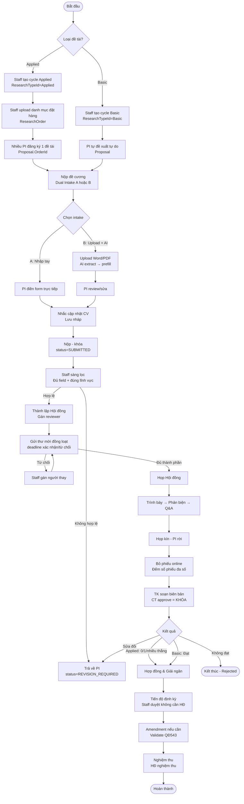
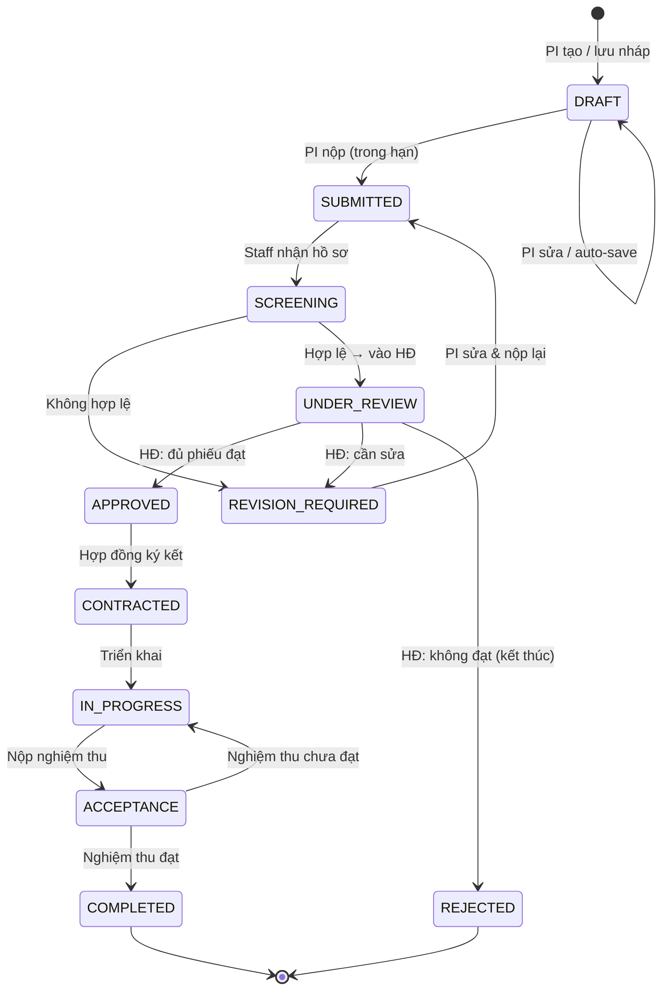
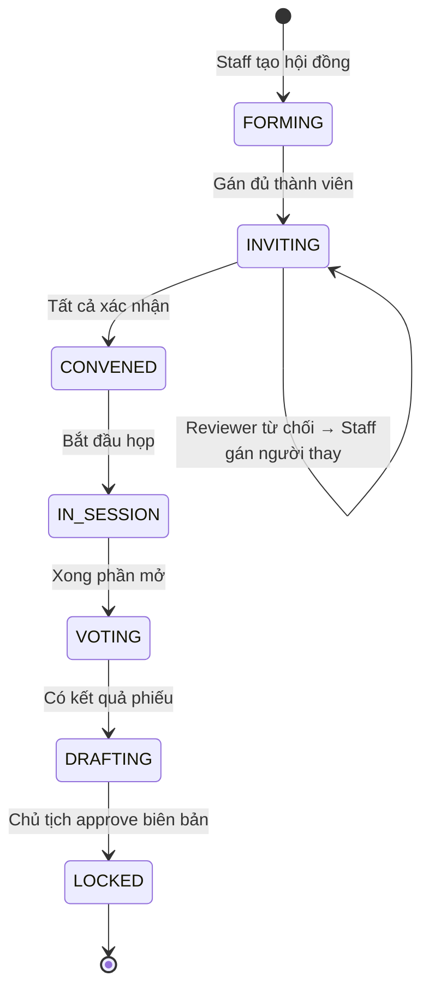

# FURPMS — Quy trình nghiệp vụ (Process Spec v2)

**Cập nhật:** 2026-06-17 (sau buổi gặp thầy tuần 6 · SU26SE053)  
**Căn cứ:** QĐ 543/QĐ-ĐHFPT; phản hồi advisor buổi gặp 16/6/2026  
**Mục đích:** tài liệu quy trình chi tiết (dùng Report 3–4, review 2 tuần 7–8); rule ngắn → xem `CLAUDE.md §Business Rules`

---

## 1. Tổng quan — 8 giai đoạn

```
[Mở đợt & danh mục] → [Nộp đề cương] → [Sàng lọc] → [Thành lập HĐ + Mời]
       → [Họp & Chấm] → [Hợp đồng & Giải ngân] → [Tiến độ / Amendment] → [Nghiệm thu]
```

---

## 2. So sánh 2 luồng: Ứng dụng vs Cơ bản

| Điểm so sánh | Ứng dụng (Applied) | Cơ bản (Basic) |
|---|---|---|
| **Ai tạo đề tài?** | Staff upload danh mục đặt hàng (`ResearchOrder`) | PI tự đề xuất tự do |
| **Quan hệ đề tài–PI** | Nhiều PI đăng ký 1 đề tài (N:1) | 1 đề tài = 1 PI (1:1) |
| **Kết quả duyệt** | 0 / 1 / nhiều PI được chọn | Đạt / Không đạt |
| **Hội đồng thêm** | Người đặt hàng (`OrderingUnit`) | Không |
| **Intake chính** | Dual (A nhập tay / B upload+AI) | Dual (A nhập tay / B upload+AI) |
| **Schema** | `ResearchOrder` + `Proposal.OrderId` (đã có); multi-winner → epic tương lai | Luồng hiện tại |

---

## 3. Chi tiết từng giai đoạn

### Giai đoạn 1 — Mở đợt & Danh mục đặt hàng

| | |
|---|---|
| **Ai tham gia** | Admin (tạo chu kỳ), Staff (upload danh mục Applied) |
| **Sản phẩm đầu ra** | `ResearchCycle` (status=OPEN, ResearchTypeId gắn đúng 1 loại); `ResearchOrder[]` (chỉ Applied) |
| **Văn bản QĐ543** | Điều khoản mở đợt, biểu mẫu đặt hàng |
| **Rule quan trọng** | 1 đợt = 1 loại; "mở cả 2" = tạo 2 cycle độc lập; bỏ "hạng quý"; Track (lĩnh vực) nhiều trong 1 đợt |

### Giai đoạn 2 — Nộp đề cương

| | |
|---|---|
| **Ai tham gia** | PI |
| **Sản phẩm đầu ra** | `Proposal` (status=DRAFT→SUBMITTED); file gốc attachment; structured fields trong DB |
| **Văn bản QĐ543** | Mẫu 1 (thuyết minh), Mẫu 3 (dự toán) |

**Dual intake — 2 đường song song (không phụ thuộc AI):**

```
Đường A (nhập tay)                     Đường B (upload + AI)
─────────────────────────────          ──────────────────────────────────────────
PI mở form trống                       PI upload file Word/PDF
       ↓                                       ↓
PI điền trực tiếp                      AI đọc & trích xuất field cấu trúc
       ↓                                       ↓
                                       Form được prefill sẵn
                                               ↓
                           PI review / sửa / bổ sung
                                    ↓
                    [Nhắc cập nhật CV/lý lịch — cũ → cảnh báo, bắt xác nhận]
                                    ↓
                          Lưu nháp (revision) ────────── auto-save
                                    ↓
                     Nộp (khóa) ← hết hạn deadline tự khóa
```

> **AI hỏng/không có → PI vẫn dùng Đường A, luồng không bị chặn.**

### Giai đoạn 3 — Sàng lọc

| | |
|---|---|
| **Ai tham gia** | Staff |
| **Sản phẩm đầu ra** | Kết quả sàng lọc (hợp lệ / không hợp lệ) |
| **Văn bản QĐ543** | Tiêu chí hợp lệ |
| **Rule** | Đủ field = hệ thống chặn; đúng lĩnh vực = AI check content vs lĩnh vực khai báo |

### Giai đoạn 4 — Thành lập Hội đồng & Mời Reviewer

| | |
|---|---|
| **Ai tham gia** | Staff (gán), Reviewer (xác nhận/từ chối) |
| **Sản phẩm đầu ra** | `ReviewCouncil` + `CouncilMember[]` (status confirmed); thư mời đã gửi |
| **Văn bản QĐ543** | Quyết định thành lập hội đồng |
| **Rule** | Gán hết → 1 nút "Gửi thư mời" đồng loạt; deadline xác nhận/từ chối; quá hạn → Staff gán người thay; chức danh (CT/TK/PB/TV) = field khi gán, không tách actor |

**Biểu mẫu versioning:** đề tài pin version `RubricTemplate` active **lúc tạo** → đổi active chỉ áp đề tài mới, không đụng đề tài cũ.

### Giai đoạn 5 — Họp Hội đồng & Chấm điểm

| | |
|---|---|
| **Ai tham gia** | Reviewer (CT, TK, PB, TV), PI (trình bày, rời phòng khi họp kín) |
| **Sản phẩm đầu ra** | `ProposalReviewScore[]`; `CouncilDecision` (kết quả); biên bản khóa |
| **Văn bản QĐ543** | Biên bản họp hội đồng |

**Quy trình họp (theo QĐ543):**

```
Trình bày (PI) → Phản biện nhận xét → Q&A → Họp kín (PI rời)
    → Bỏ phiếu online → Đếm phiếu → Kết quả
    → Thư ký soạn biên bản → Chủ tịch approve = KHÓA (revision lưu lại)
```

> **Kết quả = số phiếu đa số**, không phải Chủ tịch quyết đơn phương.  
> **Khóa biên bản:** TK edit → CT approve → status LOCKED; thành viên khác chỉ xem.

### Giai đoạn 6 — Hợp đồng & Giải ngân

| | |
|---|---|
| **Ai tham gia** | Staff (tạo hợp đồng, xác nhận giải ngân), PI (ký) |
| **Sản phẩm đầu ra** | `Contract`; `ContractDisbursement[]` (từng đợt) |
| **Văn bản QĐ543** | Hợp đồng nghiên cứu |
| **Rule** | Tiền KHÔNG tự giải ngân. deliverable PASSED → `condition_met_at` + notify Staff → Staff xác nhận tay. PARTIAL: 1 đợt/mốc. WHOLE: ≥3 đợt (đầu/giữa/cuối), tỷ lệ % config được |

### Giai đoạn 7 — Tiến độ & Amendment

| | |
|---|---|
| **Ai tham gia** | PI (nộp báo cáo, yêu cầu thay đổi), Staff (duyệt báo cáo — không cần hội đồng) |
| **Sản phẩm đầu ra** | `ProgressReport[]`; `AmendmentRequest` (nếu có) |
| **Văn bản QĐ543** | Báo cáo tiến độ định kỳ; Form gia hạn (**tối đa 1/2 thời gian thực hiện** — QĐ543 Điều 10.4; đề tài 12 tháng ⇒ 6 tháng) |
| **Rule** | Staff duyệt báo cáo tiến độ trực tiếp, không cần hội đồng. Amendment validate theo QĐ543 (gia hạn ≤ **1/2 thời gian thực hiện**, v.v.) — không phải form trắng. Chữ ký số: ngoài scope |

### Giai đoạn 8 — Nghiệm thu

| | |
|---|---|
| **Ai tham gia** | Hội đồng nghiệm thu, PI |
| **Sản phẩm đầu ra** | `AcceptanceEvaluation`; `ProductDeliverable[]` (PASSED/FAILED); `FinalReport` |
| **Văn bản QĐ543** | Biên bản nghiệm thu; báo cáo tổng kết |

---

## 4. Sơ đồ quy trình tổng thể (Mermaid)



---

## 5. State diagram — Đề tài (Proposal)



---

## 6. State diagram — Hội đồng (ReviewCouncil)



---

## 7. Checklist feedback diagram (từ advisor — cho cả team)

Dùng cho review 2 (tuần 7–8). Kiểm tra từng loại trước khi nộp:

### Context Diagram
- [ ] Mũi tên vào/ra đúng chiều (input → hệ thống → output)
- [ ] Hình chữ nhật = ranh giới hệ thống, entities bên ngoài (external actors)
- [ ] Không nhét business logic vào context diagram

### Use Case Diagram
- [ ] Box ngoài cùng = ranh giới hệ thống (system boundary)
- [ ] `<<include>>` = luôn xảy ra (bắt buộc); `<<extend>>` = có thể xảy ra (điều kiện)
- [ ] Chỉ vẽ **entity use case chính** — tránh quá chi tiết
- [ ] "System user" (actor chung 4 role) → vẽ đúng **inheritance** (generalization arrow ▷) từ Admin/Staff/PI/Reviewer lên SystemUser
- [ ] Kiểm tra COI: PI không là council member của đề tài mình

### ERD
- [ ] Vẽ **entity chính** (không cần tất cả bảng)
- [ ] Đủ **loại quan hệ**: 1-1, 1-N, N-N (với bảng junction nếu N-N)
- [ ] Ghi cardinality rõ ràng (0..1, 1..*, *)
- [ ] Phân biệt **weak entity** nếu có

### Architecture Diagram
- [ ] Vẽ **CẢ request VÀ response** (nhiều nhóm chỉ vẽ 1 chiều) ← thầy nhấn mạnh
- [ ] Ghi rõ protocol/layer (HTTP, EF, SQL)
- [ ] N-tier rõ ràng: Controller → Service → Repository → DbContext

### State Diagram
- [ ] Vẽ state của **Đề tài** (xem mục 5 ở trên)
- [ ] Vẽ state của **Hội đồng** (xem mục 6 ở trên)
- [ ] State diagram phân biệt: state = danh từ/tính từ; transition = động từ (hành động)
- [ ] Có `[*]` (initial) và điểm kết thúc rõ ràng

---

## 8. Delta map — Hiện trạng code vs Rule mới

| Rule mới | Hiện trạng schema/code | Hành động cần làm |
|---|---|---|
| Đợt = 1 loại | `ResearchCycle.ResearchTypeId` **đã có** | Chốt UX/diễn đạt; KHÔNG cần code |
| 2 luồng Ứng dụng/Cơ bản | `ResearchOrder` + `Proposal.OrderId` **đã có** | Multi-winner (N:N PI-đề tài Applied) = **epic tương lai** |
| Dual intake upload+AI | `POST /api/proposals/extract` + Gemini; file gốc lưu `Document` khi lưu nháp | ✅ PDF/DOCX → extract → chỉ prefill ô trống; AI lỗi vẫn nhập tay |
| Actor/chức danh = field | `CouncilMember.MemberRole` **đã là field** | Không cần code |
| Đếm phiếu đa số | `ProposalReviewScore` đã có | Service logic tính kết quả = **epic tương lai** |
| Khóa biên bản (TK→CT) | `CouncilDecision` đã có | Status LOCKED + revision = **epic tương lai** |
| Mời hàng loạt + deadline | `CouncilMember.InvitationToken/TokenExpiresAt/Confirmed/Declined` **đã có** | "Gửi đồng loạt" UI + email batch = **epic tương lai** |
| Pin version biểu mẫu | `RubricTemplate` đã có | Pin `RubricTemplateId` lúc tạo HĐ = **epic tương lai** |
| Amendment validate QĐ543 | `AmendmentRequest`+`AmendmentCategory` **đã có** | Validate gia hạn ≤ 1/2 thời gian thực hiện: ✅ **đã enforce 05/08** ở `ContractService.ValidateMaxExtension` (tạo + sửa hợp đồng) |

> **Kết luận:** Không cần migration mới. Các delta đều là **service/orchestration layer** — implement theo từng epic sau review 2.
