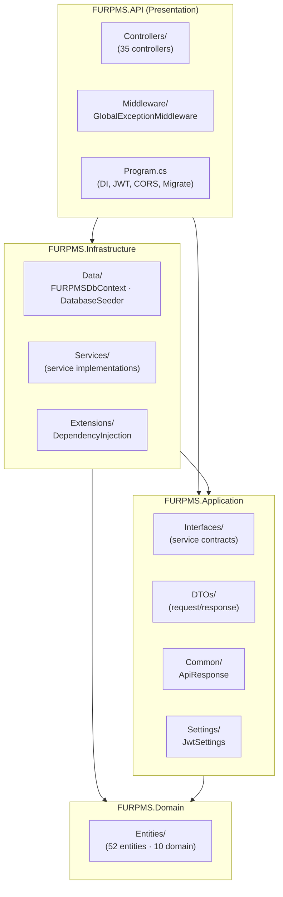
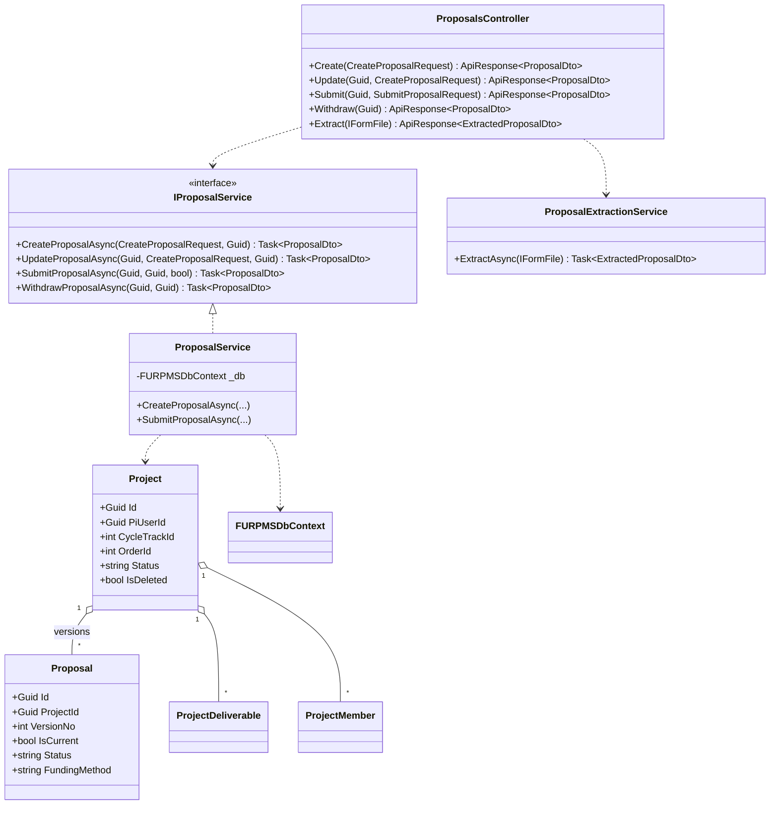
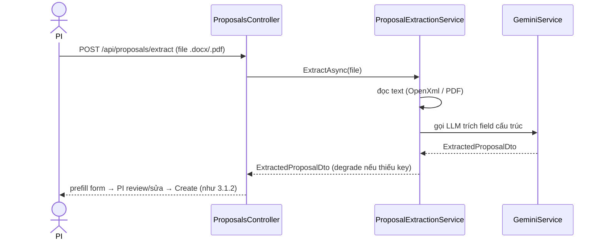
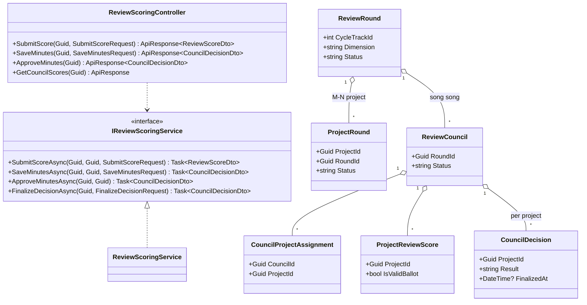
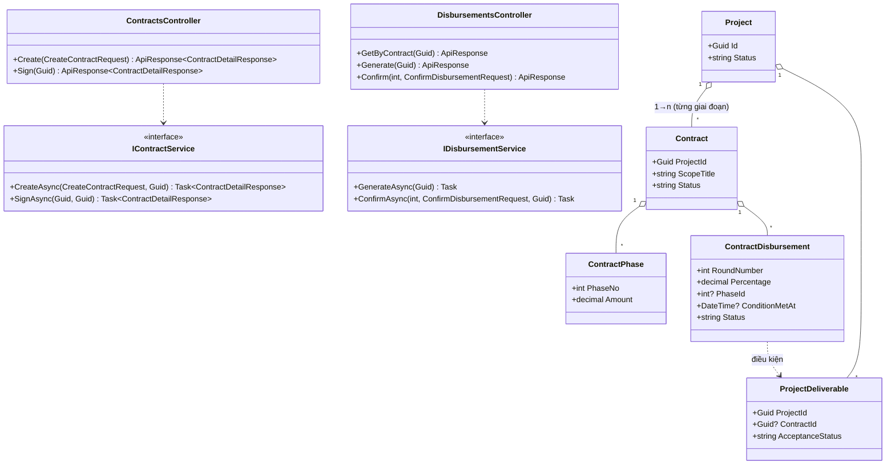

# Report 4 — Software Design Document · Bộ diagram

> Doc này gom các diagram theo đúng khung **Report 4 (SDD)**. Nguyên tắc: **cái nào đã có ở doc khác thì TRỎ TỚI, không vẽ lại.** Phần vẽ mới ở đây = **Package Diagram + Class Diagram + Sequence Diagram** (RP4 bắt buộc, chưa có nơi khác).
>
> Bản đồ nhanh khung RP4 → nguồn:
> | Mục RP4 | Trạng thái | Nguồn |
> |---|---|---|
> | 1.1 System Architecture | ✅ **đã có** | `Review2_Diagrams.md` §2 + §2b (component + deployment) |
> | 1.2 Package Diagram | 🆕 **mục 1 dưới đây** | — |
> | 2. Database Design (quan hệ) | ✅ **đã có** | `Review2_Diagrams.md` §6b · `ERD_v3_Project_Centric.dbml` (~56 bảng) |
> | 2. Database Design (mô tả bảng) | ✅ **đã có** | `DB_ANALYTIC_REPORT.md` (mô tả cột 10 domain) · tóm tắt PK/FK ở mục 2 dưới |
> | 3. Detailed Design (Class + Sequence) | 🆕 **mục 3 dưới đây** | — |

---

## 1. Package Diagram (1.2)

Solution N-tier, 4 project + `FURPMS.Tests`. Phụ thuộc **1 chiều**: `API → Infrastructure → Application → Domain` (Domain không phụ thuộc ai).



**Package Descriptions**

| No | Package (namespace) | Mô tả |
|---|---|---|
| 01 | `FURPMS.Domain.Entities` | Chỉ thực thể POCO (52 class, 10 domain: MasterData, Financial, Users, Cycles, Proposals, Review, Contracts, Progress, AI, Logs). **Không logic nghiệp vụ.** |
| 02 | `FURPMS.Application.Interfaces` | Hợp đồng service (`IProposalService`, `IReviewScoringService`, `IContractService`, `IAuthService`…) — tách interface khỏi implementation. |
| 03 | `FURPMS.Application.DTOs` | DTO request/response theo quy ước `<Entity><Action>Request/Response`. |
| 04 | `FURPMS.Application.Common` | `ApiResponse<T>` / `ApiResponse` — bao chuẩn mọi response. |
| 05 | `FURPMS.Infrastructure.Data` | `FURPMSDbContext` (EF Core, snake_case), `DatabaseSeeder` (idempotent). |
| 06 | `FURPMS.Infrastructure.Services` | Toàn bộ implementation nghiệp vụ (Controller gọi vào đây). |
| 07 | `FURPMS.Infrastructure.Extensions` | `DependencyInjection` đăng ký DI cho tầng hạ tầng. |
| 08 | `FURPMS.API.Controllers` | 35 REST controller, route kebab-case, trả `ApiResponse`. |
| 09 | `FURPMS.API.Middleware` | `GlobalExceptionMiddleware` ánh xạ exception → HTTP status (401/404/400/409/500). |

---

## 2. Database Design — tham chiếu + tóm tắt

- **Quan hệ bảng (ERD):** xem `ERD_v3_Project_Centric.dbml` (dán vào dbdiagram.io — schema HIỆN HÀNH đủ ~56 bảng + FK + unique) hoặc `Review2_Diagrams.md` §6b (Mermaid).
- **Mô tả cột chi tiết:** xem `DB_ANALYTIC_REPORT.md` (§ Schema V2.0).

> **Sau refactor Project-centric (Review 2):** `project` là gốc; `proposal` = tài liệu có version thuộc project. Đổi so bản cũ: **THÊM** project, project_member, project_deliverable (gộp expected_product + product_deliverable), cycle_track, project_round, council_project_assignment, contract_phase, proposal_change_request. **ĐỔI NEO** contract/final_report/review về project.

**Table Descriptions (tóm tắt PK/FK — ~56 bảng / 10 domain):**

| Domain | Bảng | PK | FK chính |
|---|---|---|---|
| 1 Master | research_type, research_track, product_category, amendment_category, llm_config, personnel_role_type, system_financial_config, budget_expense_category | int | — (lookup) |
| 2 Financial | budget_allocation_rule, disbursement_template | int | research_type_id |
| | council_remuneration_rate | int | — |
| | rubric_template (+track_id/order_id scope), rubric_criterion | int | criterion.template_id → rubric_template |
| 3 Users | role, user, user_role, organizational_unit, academic_profile | user=guid; unit/role=int; user_role=(user_id,role_id) | user.unit_id → org_unit; academic_profile.user_id → user (1-1) |
| 4 Cycle | research_cycle, **cycle_track** (đợt↔lĩnh vực) | int | cycle_track: cycle_id + track_id (unique) |
| | research_order (+is_default) | int | cycle_id, ordering_unit_id, matched_**project**_id |
| 5 **Project** | **project** (GỐC) | guid | cycle_track_id, order_id (NOT NULL), pi_user_id, hosting_unit_id, research_type_id |
| | **project_member**, **project_deliverable**, proposal_change_request(guid) | int/guid | *.project_id → project |
| | proposal (version), proposal_budget(1-1), proposal_budget_labor_detail, proposal_budget_item, proposal_research_content, proposal_activity | guid/int | proposal.project_id → project (unique project_id+version_no); còn lại *.proposal_id |
| 6 Review | review_round (theo **cycle_track**), **project_round** (M-N) | round=guid; project_round=int | round.cycle_track_id; project_round: project_id + round_id |
| | review_council (theo round), **council_project_assignment** | council=guid; assignment=int | council.round_id; assignment: council_id + project_id |
| | council_member, council_meeting, meeting_attendance, project_review_score(+project_id), review_score_detail, council_decision(per project), reviewer_feedback(+project_id), acceptance_evaluation(+project_id) | mixed | council_id → review_council; project_id → project |
| 7 Contract | contract (theo **project**, 1→n), **contract_phase** | contract=guid; phase=int | contract.project_id (KHÔNG unique); phase.contract_id |
| | contract_disbursement (+phase_id), contract_settlement(1-1) | int | contract_id; disbursement.deliverable_id → project_deliverable |
| 8 Progress | progress_report (theo contract), final_report(1-1 **project**) | guid | progress.contract_id; final_report.project_id |
| | progress_report_item, amendment_request(guid) | int/guid | report_id, contract_id |
| 9 AI | llm_output(guid), semantic_search_vector(int), document(guid), notification(guid) | mixed | polymorphic (entity_type+entity_id); notification.user_id → user |
| 10 Logs | audit_log, email_log | bigint | user_id / recipient_user_id → user |

*Soft-delete + global query filter trên `user`, `project`, `proposal` (`is_deleted`). Bảng cấu hình dùng `is_active`.*

---

## 3. Detailed Design

Chọn 3 feature đại diện cho 3 giai đoạn lõi. Mỗi feature: **Class Diagram + Sequence Diagram** (tên class/method lấy từ code thật).

### 3.1 Nộp đề cương (dual intake: nhập tay / upload + AI)

#### 3.1.1 Class Diagram

*Project = gốc; Proposal là tài liệu có version (v1, v2…). Tạo đề tài = tạo Project + Proposal v1; REVISION_REQUIRED → tạo bản version mới.*

#### 3.1.2 Sequence Diagram — nhập tay + nộp
```mermaid
sequenceDiagram
    actor PI
    participant C as ProposalsController
    participant S as ProposalService
    participant DB as FURPMSDbContext
    PI->>C: POST /api/proposals (CreateProposalRequest)
    C->>S: CreateProposalAsync(request, piUserId)
    S->>S: validate cycle mở + PI hợp lệ
    S->>DB: EnsureCycleTrack + ResolveOrder (order mặc định)
    S->>DB: Add(Project gốc + Proposal v1 + ProjectMembers)
    DB-->>S: saved (project=PROPOSED, proposal=DRAFT)
    S-->>C: ProposalDto (kèm projectId, versionNo)
    C-->>PI: 200 ApiResponse(ProposalDto)
    Note over PI,C: PI review/sửa (Lưu nháp = Update; REVISION → tạo bản v+1)
    PI->>C: POST /api/proposals/{id}/submit (confirmCvUpToDate)
    C->>S: SubmitProposalAsync(id, userId, confirmCvUpToDate)
    S->>S: check deadline chưa hết + CV cập nhật
    alt hợp lệ
        S->>DB: proposal=SUBMITTED, project=UNDER_REVIEW
        S-->>C: ProposalDto
        C-->>PI: 200 (đã nộp, khóa sửa)
    else quá hạn / CV cũ
        S-->>C: throw InvalidOperationException
        C-->>PI: 409 / 400
    end
```

#### 3.1.3 Sequence Diagram — đường B (upload + AI prefill)


---

### 3.2 Xét duyệt & biên bản hội đồng (Thư ký soạn → Chủ tịch quyết)

#### 3.2.1 Class Diagram

*Vòng thuộc cycle_track (dùng chung nhiều đề tài); council chấm nhóm đề tài; điểm + biên bản tách theo `project_id` (unique 3 chiều).*

#### 3.2.2 Sequence Diagram
```mermaid
sequenceDiagram
    actor Rv as Reviewer (thành viên HĐ)
    actor Sec as Thư ký
    actor Chair as Chủ tịch
    participant C as ReviewScoringController
    participant S as ReviewScoringService
    participant DB as FURPMSDbContext

    Rv->>C: POST /councils/{id}/scores (SubmitScoreRequest +projectId?)
    C->>S: SubmitScoreAsync(councilId, userId, request)
    S->>S: ResolveProject (1 đề tài→tự suy; nhiều→cần projectId)
    S->>DB: lưu ProjectReviewScore (council, project, evaluator)
    Note over S,DB: hệ thống KHÔNG tự đếm phiếu chốt

    Sec->>C: POST /councils/{id}/minutes (SaveMinutesRequest +projectId?)
    C->>S: SaveMinutesAsync(councilId, secretaryUserId, request)
    S->>DB: CouncilDecision (per project) nháp, chưa khóa
    S-->>Chair: (chỉ Chủ tịch mới duyệt được)

    Chair->>C: POST /councils/{id}/minutes/approve
    C->>S: ApproveMinutesAsync(councilId, chairUserId)
    S->>S: verify Chủ tịch; lấy biên bản nháp của đề tài
    S->>DB: CouncilDecision.FinalizedAt = now (KHÓA)
    S->>DB: proposal(hiện hành).Status + project.Status theo Result
    S->>DB: council DECIDED khi MỌI đề tài đã khóa biên bản
    S-->>C: CouncilDecisionDto
    C-->>Chair: 200 (biên bản khóa, status đề tài đổi)
```

---

### 3.3 Hợp đồng & giải ngân (giải ngân KHÔNG tự động)

#### 3.3.1 Class Diagram


#### 3.3.2 Sequence Diagram
```mermaid
sequenceDiagram
    actor Staff
    actor PI
    participant CC as ContractsController
    participant CS as ContractService
    participant DC as DisbursementsController
    participant DS as DisbursementService
    participant DB as FURPMSDbContext

    Staff->>CC: POST /api/contracts (CreateContractRequest, proposalId)
    CC->>CS: CreateAsync(request, createdBy)
    CS->>CS: resolve proposal→project; proposal=APPROVED
    CS->>DB: tạo Contract theo project (PENDING_SIGNATURE)<br/>gắn deliverable của project vào HĐ
    Staff->>CC: POST /api/contracts/{id}/sign
    CC->>CS: SignAsync(id, signedBy)
    CS->>DB: contract=ACTIVE; project=IN_PROGRESS

    Staff->>DC: POST /api/contracts/{id}/disbursements/generate
    DC->>DS: GenerateAsync(contractId)
    DS->>DB: sinh ContractDisbursement từ DisbursementTemplate<br/>(WHOLE ≥3 đợt / PARTIAL theo mốc)

    Note over PI,DB: PI nộp sản phẩm → nghiệm thu PASSED
    DB->>DB: deliverable PASSED ⇒ set ConditionMetAt + notify Staff
    Staff->>DC: POST /disbursements/{id}/confirm (ConfirmDisbursementRequest)
    DC->>DS: ConfirmAsync(id, request, processedBy)
    DS->>DB: Status = DISBURSED, ActualAmount, DisbursedAt
    Note over Staff,DB: TIỀN KHÔNG BAO GIỜ tự giải ngân — Staff xác nhận tay (rule #3)
```

---

*Ghi chú: các Sequence/Class trên bám sát code thật (`ProposalService`, `ReviewScoringService`, `ContractService`, `DisbursementService`). Activity diagram cùng luồng (mức nghiệp vụ, có actor) đã có ở `Review2_Diagrams.md` §9 — RP4 có thể tái sử dụng.*
