# FURPMS — Diagram chuẩn theo DB thật (bản nháp để vẽ lại cho Review 2)

> Vẽ từ **schema code thật** (`FURPMS.Domain/Entities/*`, `Application/Constants/DomainStatus.cs`) + **chỉnh theo góp ý thầy tuần 7**.
> Xem trong VS Code (cài "Markdown Preview Mermaid Support") hoặc dán Mermaid vào https://mermaid.live.
> Bạn nương theo đây vẽ lại bằng draw.io/StarUML cho đẹp khi trình bày.

---

## 0. Trạng thái thật trong DB (nguồn: DomainStatus.cs)

> **Cập nhật sau refactor Project-centric (09/07/2026):** `Project` giờ CÓ cột status riêng (vòng đời tổng); Proposal có versioning; round/council đổi neo. Bảng dưới đã cập nhật.

| Thực thể | Cột | Các giá trị |
|---|---|---|
| **Project** | Status | PROPOSED · UNDER_REVIEW · APPROVED · IN_PROGRESS · ACCEPTANCE · COMPLETED · CANCELLED · TERMINATED |
| Proposal (tài liệu có version) | Status | DRAFT · SUBMITTED · APPROVED · REJECTED · REVISION_REQUIRED |
| ResearchCycle | Status | PLANNING · OPEN · CLOSED |
| ReviewRound (theo cycle_track) | Status | PENDING · OPEN · PASSED · FAILED |
| **ProjectRound** (kết quả từng đề tài) | Status | PENDING · PASSED · FAILED · REVISION |
| ReviewCouncil | Status | FORMING · DECIDED |
| CouncilMember | Status | INVITED · CONFIRMED · DECLINED |
| Contract | Status | PENDING_SIGNATURE · ACTIVE · UNDER_REVIEW |
| ProgressReport | Status | DRAFT · SUBMITTED · EVALUATED |
| FinalReport (1/project) | Status | DRAFT · SUBMITTED · REVISION_REQUIRED · ACCEPTED · ARCHIVED |
| ContractDisbursement | Status | PENDING · DISBURSED |
| ProjectDeliverable | AcceptanceStatus | PENDING · PASSED · FAILED |
| AmendmentRequest | Status | PENDING · APPROVED · REJECTED |
| ProposalChangeRequest | Status | Pending · Approved · Rejected |

> ✅ `Project.Status` là vòng đời TỔNG thật (không còn "rải" như trước). Xem State Machine §4.

---

## 1. Context Diagram
Nhãn mũi tên = **danh từ** (dữ liệu), không động từ. Actor cụ thể.

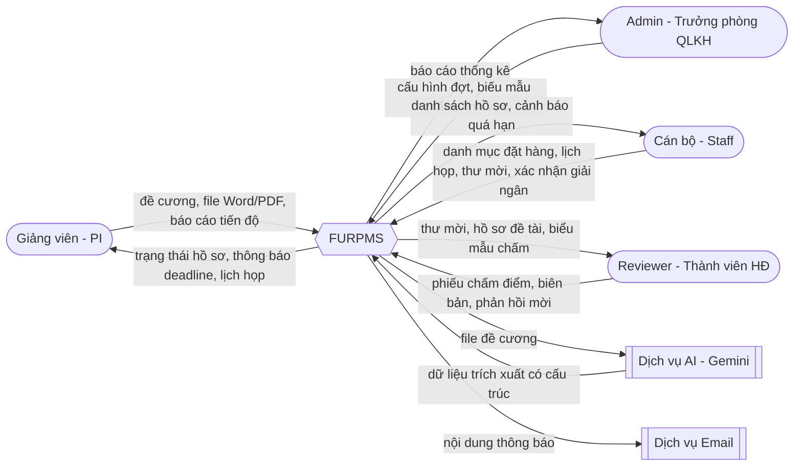
```mermaid
flowchart LR
    PI([Giảng viên - PI])
    ADMIN([Admin - Trưởng phòng QLKH])
    STAFF([Cán bộ - Staff])
    REV([Reviewer - Thành viên HĐ])
    AI[[Dịch vụ AI - Gemini]]
    MAIL[[Dịch vụ Email]]

    SYS{{FURPMS}}

    PI -->|đề cương, file Word/PDF, báo cáo tiến độ| SYS
    SYS -->|trạng thái hồ sơ, thông báo deadline, lịch họp| PI

    ADMIN -->|cấu hình đợt, biểu mẫu chấm, lĩnh vực| SYS
    SYS -->|báo cáo thống kê| ADMIN

    STAFF -->|danh mục đặt hàng, lịch họp, thư mời, xác nhận giải ngân| SYS
    SYS -->|danh sách hồ sơ, cảnh báo quá hạn| STAFF

    REV -->|phiếu chấm điểm, biên bản, phản hồi mời| SYS
    SYS -->|thư mời, hồ sơ đề tài, biểu mẫu chấm| REV

    SYS -->|file đề cương| AI
    AI -->|dữ liệu trích xuất có cấu trúc| SYS

    SYS -->|nội dung thông báo| MAIL
```

---

## 2. System Architecture
**Request = nét liền `-->`**, **Response = nét đứt `-.->`** (đúng yêu cầu thầy).

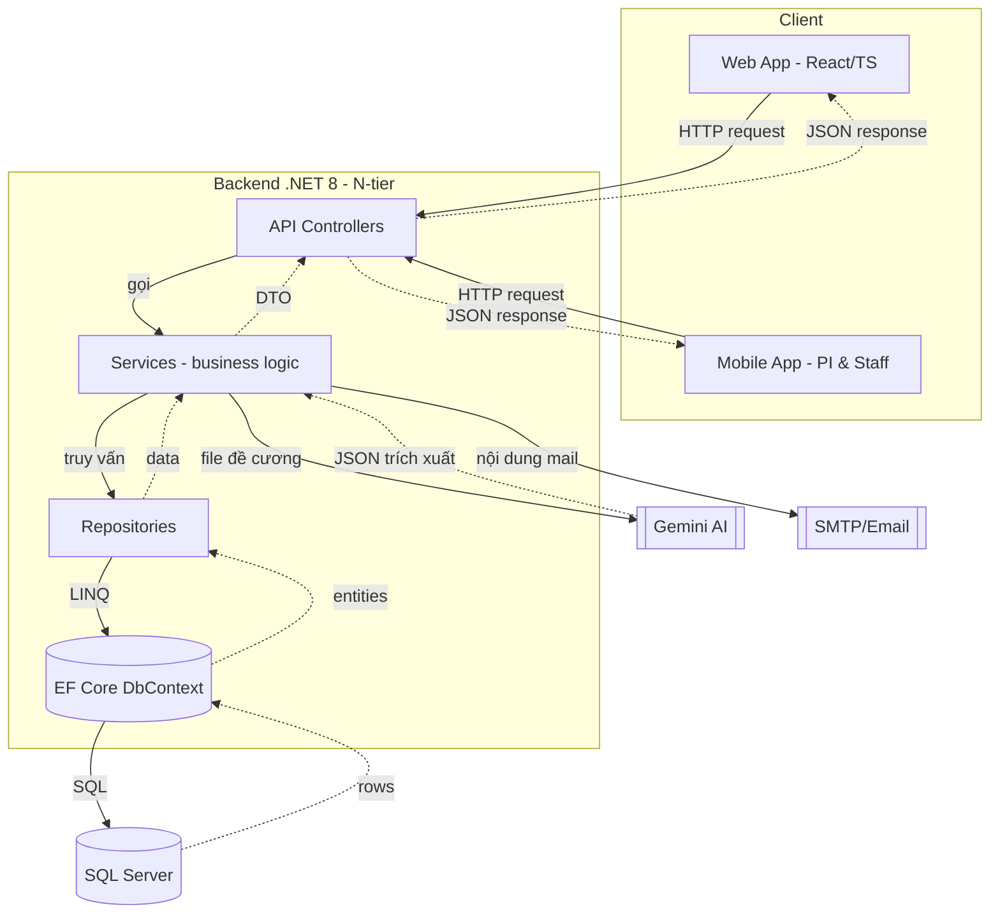
```mermaid
flowchart TB
    subgraph Client
        WEB[Web App - React/TS]
        MOB[Mobile App - PI & Staff]
    end

    subgraph Server[Backend .NET 8 - N-tier]
        API[API Controllers]
        SVC[Services - business logic]
        REPO[Repositories]
        CTX[(EF Core DbContext)]
    end

    DB[(SQL Server)]
    GEMINI[[Gemini AI]]
    EMAIL[[SMTP/Email]]

    WEB -->|HTTP request| API
    MOB -->|HTTP request| API
    API -.->|JSON response| WEB
    API -.->|JSON response| MOB

    API -->|gọi| SVC
    SVC -->|truy vấn| REPO
    REPO -->|LINQ| CTX
    CTX -->|SQL| DB
    DB -.->|rows| CTX
    CTX -.->|entities| REPO
    REPO -.->|data| SVC
    SVC -.->|DTO| API

    SVC -->|file đề cương| GEMINI
    GEMINI -.->|JSON trích xuất| SVC
    SVC -->|nội dung mail| EMAIL
```

---

## 2b. System Overview (mức cao — component + deployment)
Góc nhìn tổng quan: actor → client → backend → DB + dịch vụ bên thứ 3, kèm **nơi triển khai**. (§2 đi sâu tầng nội bộ; §2b cho cái nhìn toàn cảnh dễ trình bày trên slide.)

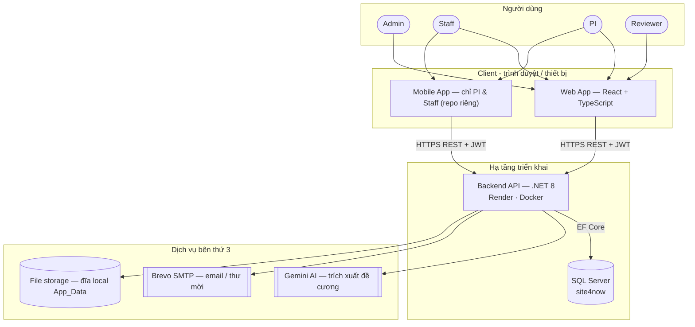
```mermaid
flowchart TB
    subgraph users["Người dùng"]
        ADMIN([Admin])
        STAFF([Staff])
        PI([PI])
        REV([Reviewer])
    end

    subgraph clients["Client - trình duyệt / thiết bị"]
        WEB["Web App — React + TypeScript"]
        MOB["Mobile App — chỉ PI & Staff (repo riêng)"]
    end

    subgraph cloud["Hạ tầng triển khai"]
        API["Backend API — .NET 8<br/>Render · Docker"]
        DB[("SQL Server<br/>site4now")]
    end

    subgraph third["Dịch vụ bên thứ 3"]
        GEMINI[["Gemini AI — trích xuất đề cương"]]
        EMAIL[["Brevo SMTP — email / thư mời"]]
        STORE[("File storage — đĩa local App_Data")]
    end

    ADMIN --> WEB
    STAFF --> WEB
    PI --> WEB
    REV --> WEB
    PI --> MOB
    STAFF --> MOB
    WEB -->|HTTPS REST + JWT| API
    MOB -->|HTTPS REST + JWT| API
    API -->|EF Core| DB
    API --> GEMINI
    API --> EMAIL
    API --> STORE
```

> Nguồn công nghệ/dịch vụ chi tiết: `Review2_Tech_Stack.md`.

---

## 3. State Machine — PROPOSAL (Đề cương, tài liệu có version)
Theo `ProposalStatus`. **Proposal giờ là tài liệu có version thuộc Project.** REVISION_REQUIRED → tạo **bản version mới** (v2, v3…) DRAFT, bản cũ giữ lịch sử (`is_current=false`). **Hội đồng KHÔNG có state.**

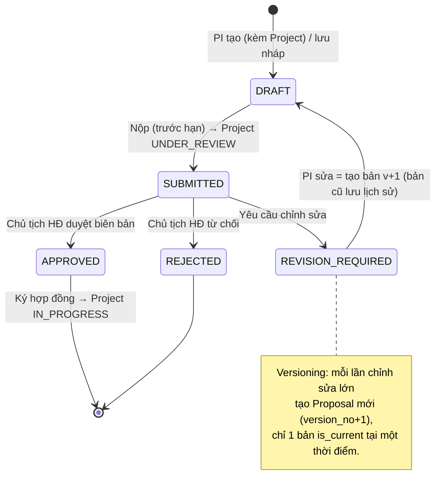
```mermaid
stateDiagram-v2
    [*] --> DRAFT : PI tạo (kèm Project) / lưu nháp
    DRAFT --> SUBMITTED : Nộp (trước hạn) → Project UNDER_REVIEW
    SUBMITTED --> APPROVED : Chủ tịch HĐ duyệt biên bản
    SUBMITTED --> REJECTED : Chủ tịch HĐ từ chối
    SUBMITTED --> REVISION_REQUIRED : Yêu cầu chỉnh sửa
    REVISION_REQUIRED --> DRAFT : PI sửa = tạo bản v+1 (bản cũ lưu lịch sử)
    APPROVED --> [*] : Ký hợp đồng → Project IN_PROGRESS
    REJECTED --> [*]

    note right of REVISION_REQUIRED
        Versioning: mỗi lần chỉnh sửa lớn
        tạo Proposal mới (version_no+1),
        chỉ 1 bản is_current tại một thời điểm.
    end note
```

---

## 4. State Machine — PROJECT (Đề tài, gốc)
**`projects.status` là cột THẬT** (không còn compose). Đây là vòng đời tổng của đề tài, xuyên suốt từ đề xuất → xét duyệt → thực hiện → nghiệm thu.

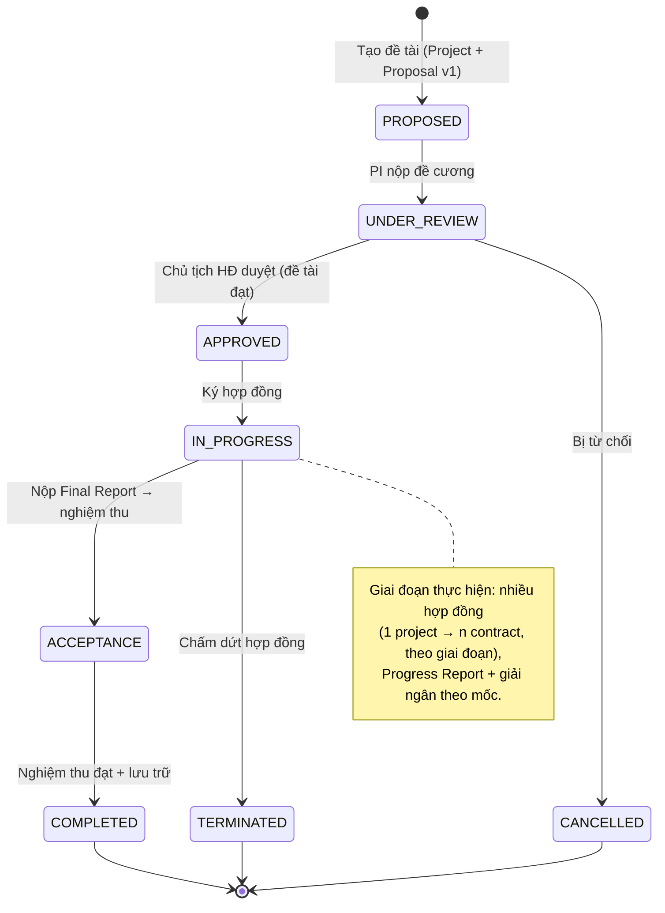
```mermaid
stateDiagram-v2
    [*] --> PROPOSED : Tạo đề tài (Project + Proposal v1)
    PROPOSED --> UNDER_REVIEW : PI nộp đề cương
    UNDER_REVIEW --> APPROVED : Chủ tịch HĐ duyệt (đề tài đạt)
    UNDER_REVIEW --> CANCELLED : Bị từ chối
    APPROVED --> IN_PROGRESS : Ký hợp đồng
    IN_PROGRESS --> ACCEPTANCE : Nộp Final Report → nghiệm thu
    ACCEPTANCE --> COMPLETED : Nghiệm thu đạt + lưu trữ
    IN_PROGRESS --> TERMINATED : Chấm dứt hợp đồng
    COMPLETED --> [*]
    CANCELLED --> [*]
    TERMINATED --> [*]

    note right of IN_PROGRESS
        Giai đoạn thực hiện: nhiều hợp đồng
        (1 project → n contract, theo giai đoạn),
        Progress Report + giải ngân theo mốc.
    end note
```

---

## 5. State Machine — FINAL REPORT (Báo cáo nghiệm thu)
Theo `FinalReportStatus` (+ default entity = DRAFT).

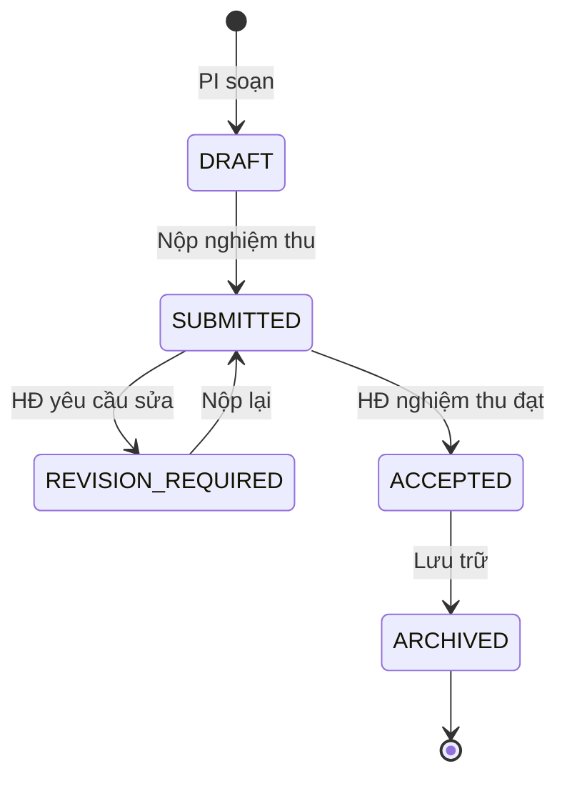
```mermaid
stateDiagram-v2
    [*] --> DRAFT : PI soạn
    DRAFT --> SUBMITTED : Nộp nghiệm thu
    SUBMITTED --> REVISION_REQUIRED : HĐ yêu cầu sửa
    REVISION_REQUIRED --> SUBMITTED : Nộp lại
    SUBMITTED --> ACCEPTED : HĐ nghiệm thu đạt
    ACCEPTED --> ARCHIVED : Lưu trữ
    ARCHIVED --> [*]
```

---

## 5b. State Machine — bổ sung (Contract / Review Round / Progress Report)
Theo đúng giá trị `Status` trong `DomainStatus.cs`.

### Contract (hợp đồng)
> `Contract.Status` ∈ {PENDING_SIGNATURE, ACTIVE, UNDER_REVIEW}. "Hoàn tất / chấm dứt" thể hiện qua **field** (SignedAt / TerminatedAt / Settlement), không phải Status riêng.
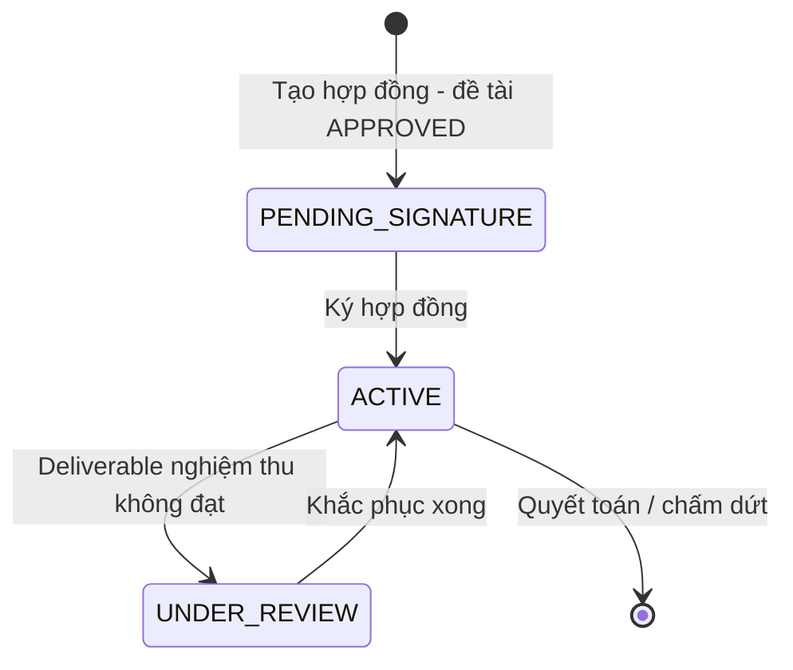
```mermaid
stateDiagram-v2
    [*] --> PENDING_SIGNATURE : Tạo hợp đồng - đề tài APPROVED
    PENDING_SIGNATURE --> ACTIVE : Ký hợp đồng
    ACTIVE --> UNDER_REVIEW : Deliverable nghiệm thu không đạt
    UNDER_REVIEW --> ACTIVE : Khắc phục xong
    ACTIVE --> [*] : Quyết toán / chấm dứt
```

### Review Round (vòng chấm) + Project–Round (kết quả từng đề tài)
> **Sau Phase B:** `review_round` thuộc **cycle_track** (dùng chung nhiều đề tài); kết quả CHẤM của từng đề tài nằm ở `project_round.status`. SM dưới là của `project_round` (đề tài đi qua vòng).
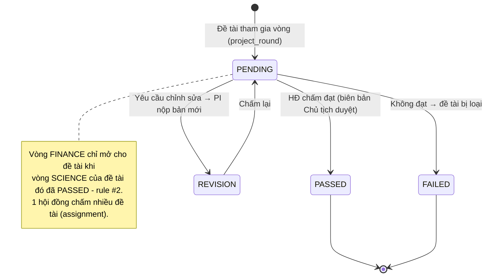
```mermaid
stateDiagram-v2
    [*] --> PENDING : Đề tài tham gia vòng (project_round)
    PENDING --> PASSED : HĐ chấm đạt (biên bản Chủ tịch duyệt)
    PENDING --> FAILED : Không đạt → đề tài bị loại
    PENDING --> REVISION : Yêu cầu chỉnh sửa → PI nộp bản mới
    REVISION --> PENDING : Chấm lại
    PASSED --> [*]
    FAILED --> [*]
    note right of PENDING
        Vòng FINANCE chỉ mở cho đề tài khi
        vòng SCIENCE của đề tài đó đã PASSED - rule #2.
        1 hội đồng chấm nhiều đề tài (assignment).
    end note
```

### Progress Report (báo cáo tiến độ)
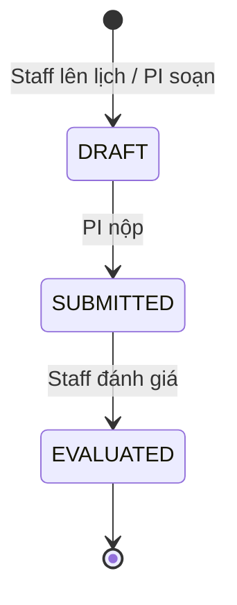
```mermaid
stateDiagram-v2
    [*] --> DRAFT : Staff lên lịch / PI soạn
    DRAFT --> SUBMITTED : PI nộp
    SUBMITTED --> EVALUATED : Staff đánh giá
    EVALUATED --> [*]
```

> **Cycle (đợt nộp)** quá tuyến tính nên không vẽ riêng: `PLANNING → OPEN → CLOSED`.

---

## 6. ERD — quan hệ thật (rút gọn các thực thể lõi)
Đúng theo navigation property hiện tại. Chú ý: ProgressReport/FinalReport neo vào **Contract**, không phải Proposal.

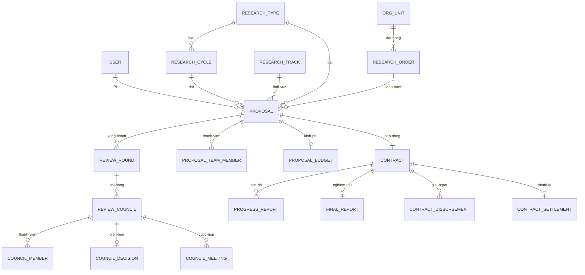
```mermaid
erDiagram
    USER ||--o{ PROPOSAL : "PI"
    RESEARCH_TYPE ||--o{ RESEARCH_CYCLE : "loai"
    RESEARCH_CYCLE ||--o{ PROPOSAL : "dot"
    RESEARCH_TRACK ||--o{ PROPOSAL : "linh-vuc"
    RESEARCH_TYPE ||--o{ PROPOSAL : "loai"
    ORG_UNIT ||--o{ RESEARCH_ORDER : "dat-hang"
    RESEARCH_ORDER |o--o{ PROPOSAL : "canh-tranh"

    PROPOSAL ||--|| CONTRACT : "hop-dong"
    PROPOSAL ||--o{ PROPOSAL_TEAM_MEMBER : "thanh-vien"
    PROPOSAL ||--o| PROPOSAL_BUDGET : "kinh-phi"
    PROPOSAL ||--o{ REVIEW_ROUND : "vong-cham"
    REVIEW_ROUND ||--o{ REVIEW_COUNCIL : "hoi-dong"
    REVIEW_COUNCIL ||--o{ COUNCIL_MEMBER : "thanh-vien"
    REVIEW_COUNCIL ||--o| COUNCIL_DECISION : "bien-ban"
    REVIEW_COUNCIL ||--o{ COUNCIL_MEETING : "cuoc-hop"

    CONTRACT ||--o{ PROGRESS_REPORT : "tien-do"
    CONTRACT ||--o| FINAL_REPORT : "nghiem-thu"
    CONTRACT ||--o{ CONTRACT_DISBURSEMENT : "giai-ngan"
    CONTRACT ||--o| CONTRACT_SETTLEMENT : "thanh-ly"
```

> Ghi chú đọc ERD: `||--o{` = 1 tới nhiều; `|o--o{` = 0/1 tới nhiều; `||--||` = 1–1; `||--o|` = 1 tới 0/1.

---

## 6b. Logical ERD — đầy đủ (thực thể + thuộc tính chính + PK/FK)
§6 là sơ đồ quan hệ rút gọn (chỉ tên + cardinality). §6b này là **Logical ERD chuẩn**: mỗi thực thể lõi kèm **khóa chính (PK), khóa ngoại (FK) và các trường nghiệp vụ chính**. (Schema vật lý đầy đủ 44 bảng + kiểu dữ liệu/CHECK xem `DB_ANALYTIC_REPORT.md`.)

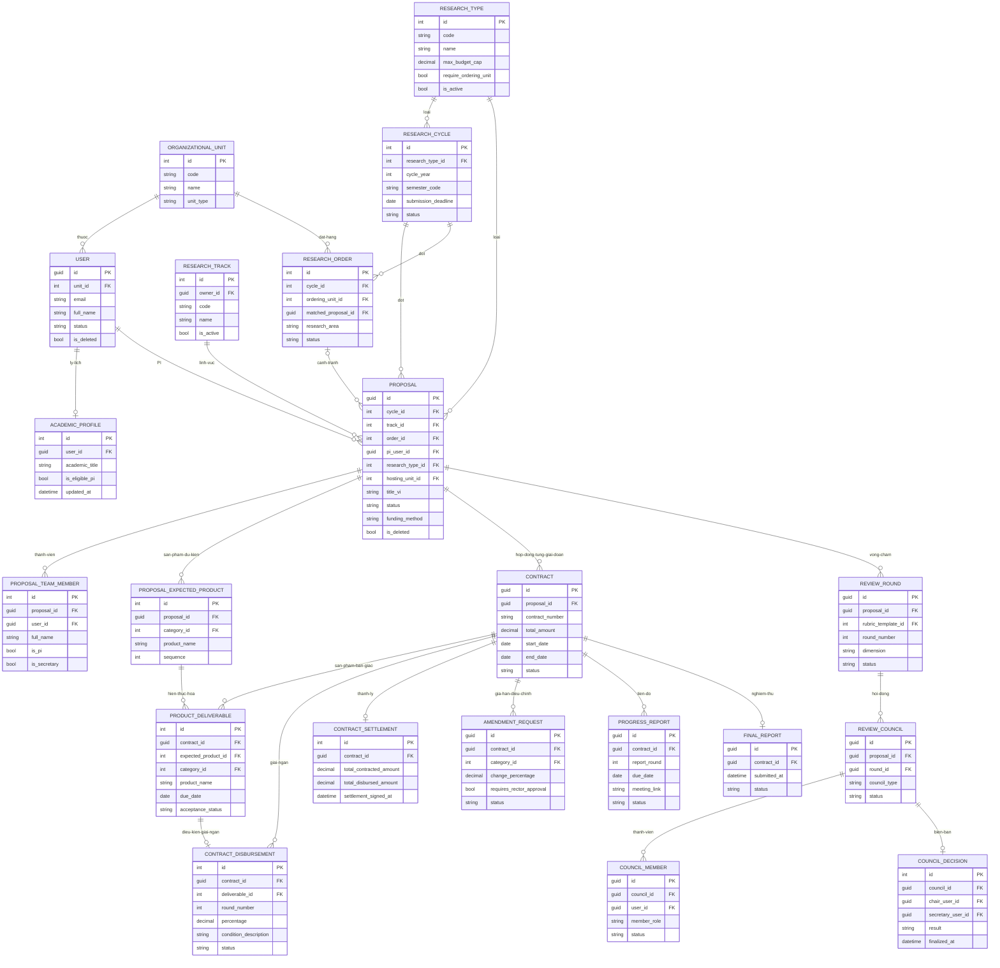
```mermaid
erDiagram
    ORGANIZATIONAL_UNIT {
        int id PK
        string code
        string name
        string unit_type
    }
    USER {
        guid id PK
        int unit_id FK
        string email
        string full_name
        string status
        bool is_deleted
    }
    ACADEMIC_PROFILE {
        int id PK
        guid user_id FK
        string academic_title
        bool is_eligible_pi
        datetime updated_at
    }
    RESEARCH_TYPE {
        int id PK
        string code
        string name
        decimal max_budget_cap
        bool require_ordering_unit
        bool is_active
    }
    RESEARCH_CYCLE {
        int id PK
        int research_type_id FK
        int cycle_year
        string semester_code
        date submission_deadline
        string status
    }
    RESEARCH_TRACK {
        int id PK
        guid owner_id FK
        string code
        string name
        bool is_active
    }
    RESEARCH_ORDER {
        int id PK
        int cycle_id FK
        int ordering_unit_id FK
        guid matched_proposal_id FK
        string research_area
        string status
    }
    PROPOSAL {
        guid id PK
        int cycle_id FK
        int track_id FK
        int order_id FK
        guid pi_user_id FK
        int research_type_id FK
        int hosting_unit_id FK
        string title_vi
        string status
        string funding_method
        bool is_deleted
    }
    PROPOSAL_TEAM_MEMBER {
        int id PK
        guid proposal_id FK
        guid user_id FK
        string full_name
        bool is_pi
        bool is_secretary
    }
    CONTRACT {
        guid id PK
        guid proposal_id FK
        string contract_number
        decimal total_amount
        date start_date
        date end_date
        string status
    }
    REVIEW_ROUND {
        guid id PK
        guid proposal_id FK
        int rubric_template_id FK
        int round_number
        string dimension
        string status
    }
    REVIEW_COUNCIL {
        guid id PK
        guid proposal_id FK
        guid round_id FK
        string council_type
        string status
    }
    COUNCIL_MEMBER {
        guid id PK
        guid council_id FK
        guid user_id FK
        string member_role
        string status
    }
    COUNCIL_DECISION {
        int id PK
        guid council_id FK
        guid chair_user_id FK
        guid secretary_user_id FK
        string result
        datetime finalized_at
    }
    PROGRESS_REPORT {
        guid id PK
        guid contract_id FK
        int report_round
        date due_date
        string meeting_link
        string status
    }
    FINAL_REPORT {
        guid id PK
        guid contract_id FK
        datetime submitted_at
        string status
    }
    PROPOSAL_EXPECTED_PRODUCT {
        int id PK
        guid proposal_id FK
        int category_id FK
        string product_name
        int sequence
    }
    PRODUCT_DELIVERABLE {
        int id PK
        guid contract_id FK
        int expected_product_id FK
        int category_id FK
        string product_name
        date due_date
        string acceptance_status
    }
    CONTRACT_DISBURSEMENT {
        int id PK
        guid contract_id FK
        int deliverable_id FK
        int round_number
        decimal percentage
        string condition_description
        string status
    }
    CONTRACT_SETTLEMENT {
        int id PK
        guid contract_id FK
        decimal total_contracted_amount
        decimal total_disbursed_amount
        datetime settlement_signed_at
    }
    AMENDMENT_REQUEST {
        guid id PK
        guid contract_id FK
        int category_id FK
        decimal change_percentage
        bool requires_rector_approval
        string status
    }

    ORGANIZATIONAL_UNIT ||--o{ USER : "thuoc"
    USER ||--o| ACADEMIC_PROFILE : "ly-lich"
    USER ||--o{ PROPOSAL : "PI"
    RESEARCH_TYPE ||--o{ RESEARCH_CYCLE : "loai"
    RESEARCH_TYPE ||--o{ PROPOSAL : "loai"
    RESEARCH_CYCLE ||--o{ PROPOSAL : "dot"
    RESEARCH_TRACK ||--o{ PROPOSAL : "linh-vuc"
    RESEARCH_CYCLE ||--o{ RESEARCH_ORDER : "dot"
    ORGANIZATIONAL_UNIT ||--o{ RESEARCH_ORDER : "dat-hang"
    RESEARCH_ORDER |o--o{ PROPOSAL : "canh-tranh"
    PROPOSAL ||--o{ PROPOSAL_TEAM_MEMBER : "thanh-vien"
    PROPOSAL ||--o{ PROPOSAL_EXPECTED_PRODUCT : "san-pham-du-kien"
    PROPOSAL ||--o{ CONTRACT : "hop-dong-tung-giai-doan"
    PROPOSAL ||--o{ REVIEW_ROUND : "vong-cham"
    REVIEW_ROUND ||--o{ REVIEW_COUNCIL : "hoi-dong"
    REVIEW_COUNCIL ||--o{ COUNCIL_MEMBER : "thanh-vien"
    REVIEW_COUNCIL ||--o| COUNCIL_DECISION : "bien-ban"
    CONTRACT ||--o{ PRODUCT_DELIVERABLE : "san-pham-ban-giao"
    PROPOSAL_EXPECTED_PRODUCT ||--o{ PRODUCT_DELIVERABLE : "hien-thuc-hoa"
    CONTRACT ||--o{ CONTRACT_DISBURSEMENT : "giai-ngan"
    PRODUCT_DELIVERABLE ||--o| CONTRACT_DISBURSEMENT : "dieu-kien-giai-ngan"
    CONTRACT ||--o| CONTRACT_SETTLEMENT : "thanh-ly"
    CONTRACT ||--o{ AMENDMENT_REQUEST : "gia-han-dieu-chinh"
    CONTRACT ||--o{ PROGRESS_REPORT : "tien-do"
    CONTRACT ||--o| FINAL_REPORT : "nghiem-thu"
```

> **Lưu ý quan hệ Proposal ↔ Contract:** sơ đồ vẽ **1 proposal → nhiều contract** (mỗi hợp đồng = 1 giai đoạn/1 nhóm sản phẩm — ví dụ "xe máy" của thầy). **DB hiện tại đang ép 1–1** bằng unique index `contract.proposal_id` (`FURPMSDbContext.cs:378`); đề xuất **bỏ ràng buộc này sau Review 2** (đã thực hiện ở Phase A: 1 project → nhiều contract).

---

## 7. ĐÁNH GIÁ DB/CODE — chốt lại sau khi rà ghi âm thầy

> ## ⚠️ CẬP NHẬT SAU REVIEW 2 — Phase A + B ĐÃ CODE XONG (09/07/2026)
> Kết luận §7 bên dưới ("không cần bảng Project") **đã bị đảo ngược & đã thực thi**: biên bản Review 2 yêu cầu **Project = thực thể trung tâm** + Cycle–Track + Round M-N theo track + 100% order coverage + Contract phase — **tất cả đã vào code** (56 bảng, migrations `PhaseA_ProjectCentric` + `PhaseB_ReviewMN` + `PhaseC_ChangeRequests`, 40/40 test, đã test UI end-to-end trọn luồng).
> → Schema HIỆN HÀNH: **`ERD_v3_Project_Centric.dbml`**. Phân tích: `DB_Redesign_v3_PostReview2.md`. **§6/§6b/§7 bên dưới là ảnh chụp TRƯỚC refactor — chỉ giữ làm lịch sử** (§0–§5b + §8–§9 ở trên/dưới đã cập nhật theo model mới).

> Phân tích đầy đủ (bóc ghi âm + thiết kế đích) đã gộp vào **`DB_Redesign_v3_PostReview2.md`**. Tóm tắt kết luận ở đây.

### 7.1 Hiện trạng (đọc trực tiếp từ entity)
- **Không có bảng `Project`.** `Proposal` (Guid) đang là thực thể gốc trên thực tế.
- `Contract` **đang 1–1 `Proposal`** (unique index `contract.proposal_id` — `FURPMSDbContext.cs:378`). `ProgressReport`, `FinalReport`, `ContractDisbursement`, `ContractSettlement`, `AmendmentRequest` neo vào `Contract`.
- Sản phẩm **đã có**: `ProposalExpectedProduct` (mức đề cương) → `ProductDeliverable` (mức hợp đồng, nghiệm thu từng cái) — trước đây **không vẽ lên ERD** nên thầy tưởng thiếu (đã bổ sung ở §6b).
- `ReviewRound`/`ReviewCouncil` neo vào `Proposal`.

### 7.2 Kết luận (đã đối chiếu lời thầy)
Thầy **không bắt thêm bảng `Project`** — câu "có thêm project không?" là hỏi thăm dò. Hai điểm thầy thật sự chốt:
1. **Contract phải thể hiện sản phẩm** → DB **đã có** (`ProductDeliverable`), chỉ cần **vẽ lại ERD** (xong ở §6b). Không đổi DB.
2. **1 proposal nên có nhiều contract** (ký từng giai đoạn — ví dụ xe máy) → DB **đang ép 1–1**, cần **bỏ unique index** — nhưng để **sau Review 2**.

Khái niệm "project" = **proposal + các hợp đồng giai đoạn của nó**; sau khi bỏ ràng buộc 1–1 thì biểu diễn đủ **mà không cần bảng mới**.

### 7.3 Việc DB cần làm (sau Review 2, chỉ đề xuất)
- **Bỏ unique `contract.proposal_id`** → 1 proposal → n contract. Ăn khớp `Proposal.FundingMethod`: WHOLE = 1 hợp đồng + nhiều đợt giải ngân (rule #6); PARTIAL = nhiều hợp đồng theo giai đoạn.
- **Chốt neo `FinalReport`** (đang unique theo `contract_id`): 1 đề tài 1 final tổng, hay mỗi giai đoạn 1 cái?
- **Ripple:** ~13 service giả định Contract 1–1 Proposal (`ContractService`, `DisbursementService`, `FinalReportService`, …) phải sửa query. → chính vì ripple này nên **không làm gấp trước Review 2**.
- **KHÔNG** thêm bảng `Project` (để ngỏ cho tương lai nếu 1 đề tài đẻ ra quá nhiều hợp đồng/vòng phức tạp).

### 7.4 Các điểm code khác (cập nhật trạng thái sau đợt code tuần 7)
- ✅ **Upload file**: đã thêm `ProposalDocumentsController` + `DocumentsController` + `ProposalDocumentService` (lưu đĩa, metadata qua `Document`). Hết 404.
- ✅ **AI đọc Word/PDF**: `GeminiService` thêm multimodal (PDF inline) + `ProposalExtractionService` (.docx OpenXml/.pdf/.txt) + endpoint `POST /api/proposals/extract`. Degrade an toàn khi thiếu key.
- ✅ **Quyết định Đạt/Trượt**: đã có workflow **Thư ký soạn → Chủ tịch duyệt/khóa** (`SaveMinutesAsync`/`ApproveMinutesAsync`); status đề tài chỉ đổi khi Chủ tịch duyệt; điểm/phiếu chỉ tham khảo.
- ✅ **Applied 1-winner**: `ResearchOrderService.MatchWinnerAsync` (winner APPROVED, auto-loại cạnh tranh).
- ✅ **Mời reviewer hàng loạt + deadline + COI** (chặn cả thành viên đề tài); ✅ **nhắc CV trước nộp** + chặn sửa quá hạn.
- ⏳ **Proposal state "Under Review"** tường minh: vẫn đi thẳng SUBMITTED→APPROVED (review state ở `ReviewRound`); chưa thêm (nhẹ, tùy chọn).
- ⏳ **Còn lại**: FE PI đăng ký đề tài đặt hàng; **Phase template versioning + lịch báo cáo** (cần migration).

> Chi tiết kế hoạch sửa toàn bộ: xem file plan `audit-task-do-pure-treehouse.md`.

---

## 8. Use Case Diagram
Vẽ từ controller/service thật. 4 actor: **Admin / Staff / PI / Reviewer** (không "System User"). Actor phụ: **AI (Gemini)**, **Email**.
**Chức danh Chủ tịch/Thư ký/Phản biện KHÔNG phải actor riêng** — chỉ là *field* khi gán; Reviewer là 1 actor, một số UC bị giới hạn theo chức danh (ghi chú trong sơ đồ).

> ⚠️ Hướng mũi tên (chỗ thầy hay bắt lỗi):
> - **«include»**: UC gốc → UC con (gốc luôn dùng con). VD: "Nộp đề cương" **--«include»-->** "Kiểm tra hạn nộp".
> - **«extend»**: UC mở rộng → UC gốc (tùy chọn, thêm vào gốc). VD: "Trích xuất AI" **--«extend»-->** "Soạn & nộp đề cương".

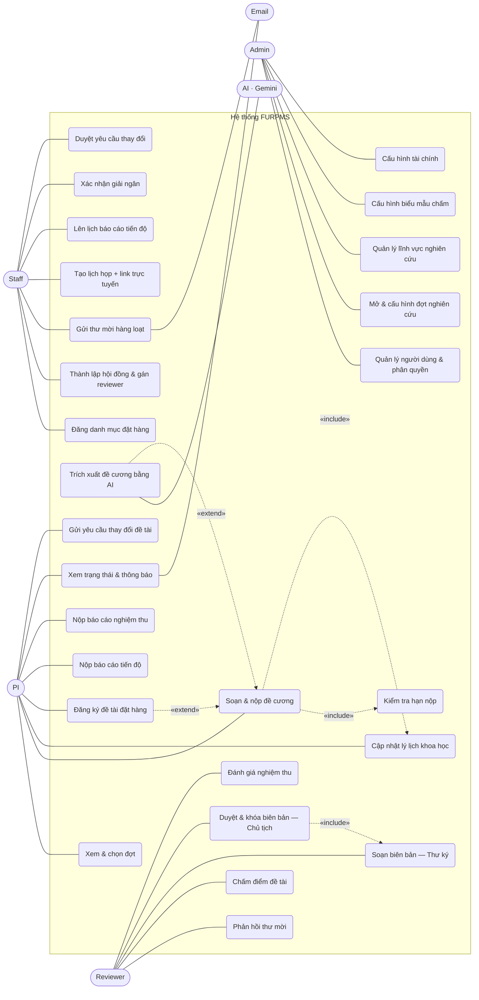
```mermaid
flowchart LR
    ADMIN(["Admin"])
    STAFF(["Staff"])
    PI(["PI"])
    REV(["Reviewer"])
    AI(["AI · Gemini"])
    MAIL(["Email"])

    subgraph FURPMS["Hệ thống FURPMS"]
        UC_user("Quản lý người dùng & phân quyền")
        UC_cycle("Mở & cấu hình đợt nghiên cứu")
        UC_track("Quản lý lĩnh vực nghiên cứu")
        UC_rubric("Cấu hình biểu mẫu chấm")
        UC_fin("Cấu hình tài chính")

        UC_order("Đăng danh mục đặt hàng")
        UC_council("Thành lập hội đồng & gán reviewer")
        UC_invite("Gửi thư mời hàng loạt")
        UC_meeting("Tạo lịch họp + link trực tuyến")
        UC_schedule("Lên lịch báo cáo tiến độ")
        UC_disb("Xác nhận giải ngân")

        UC_choose("Xem & chọn đợt")
        UC_draft("Soạn & nộp đề cương")
        UC_ai("Trích xuất đề cương bằng AI")
        UC_cv("Cập nhật lý lịch khoa học")
        UC_deadline("Kiểm tra hạn nộp")
        UC_register("Đăng ký đề tài đặt hàng")
        UC_progress("Nộp báo cáo tiến độ")
        UC_final("Nộp báo cáo nghiệm thu")
        UC_status("Xem trạng thái & thông báo")
        UC_change("Gửi yêu cầu thay đổi đề tài")

        UC_reviewchange("Duyệt yêu cầu thay đổi")
        UC_respond("Phản hồi thư mời")
        UC_score("Chấm điểm đề tài")
        UC_minutes("Soạn biên bản — Thư ký")
        UC_approve("Duyệt & khóa biên bản — Chủ tịch")
        UC_accept("Đánh giá nghiệm thu")
    end

    ADMIN --- UC_user
    ADMIN --- UC_cycle
    ADMIN --- UC_track
    ADMIN --- UC_rubric
    ADMIN --- UC_fin

    STAFF --- UC_order
    STAFF --- UC_council
    STAFF --- UC_invite
    STAFF --- UC_meeting
    STAFF --- UC_schedule
    STAFF --- UC_disb
    STAFF --- UC_reviewchange

    PI --- UC_choose
    PI --- UC_draft
    PI --- UC_cv
    PI --- UC_register
    PI --- UC_progress
    PI --- UC_final
    PI --- UC_status
    PI --- UC_change

    REV --- UC_respond
    REV --- UC_score
    REV --- UC_minutes
    REV --- UC_approve
    REV --- UC_accept

    UC_ai --- AI
    UC_invite --- MAIL
    UC_status --- MAIL

    UC_draft -.->|"«include»"| UC_deadline
    UC_draft -.->|"«include»"| UC_cv
    UC_ai -.->|"«extend»"| UC_draft
    UC_register -.->|"«extend»"| UC_draft
    UC_approve -.->|"«include»"| UC_minutes
```

> Ghi chú chức danh: `UC_minutes` chỉ Reviewer là **Thư ký** thực hiện; `UC_approve` chỉ **Chủ tịch**. Kết quả Đạt/Trượt do **Chủ tịch chốt** khi duyệt biên bản (không tự đếm phiếu).

### 8b. Bản PlantUML (để vẽ chuẩn UML — dán vào plantuml.com)
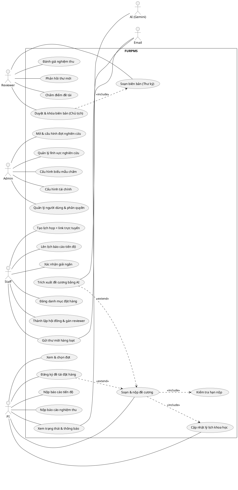
```plantuml
@startuml
left to right direction
skinparam packageStyle rectangle

actor "Admin" as ADMIN
actor "Staff" as STAFF
actor "PI" as PI
actor "Reviewer" as REV
actor "AI (Gemini)" as AI
actor "Email" as MAIL

rectangle "FURPMS" {
  usecase "Quản lý người dùng & phân quyền" as UCuser
  usecase "Mở & cấu hình đợt nghiên cứu" as UCcycle
  usecase "Quản lý lĩnh vực nghiên cứu" as UCtrack
  usecase "Cấu hình biểu mẫu chấm" as UCrubric
  usecase "Cấu hình tài chính" as UCfin

  usecase "Đăng danh mục đặt hàng" as UCorder
  usecase "Thành lập hội đồng & gán reviewer" as UCcouncil
  usecase "Gửi thư mời hàng loạt" as UCinvite
  usecase "Tạo lịch họp + link trực tuyến" as UCmeeting
  usecase "Lên lịch báo cáo tiến độ" as UCschedule
  usecase "Xác nhận giải ngân" as UCdisb

  usecase "Xem & chọn đợt" as UCchoose
  usecase "Soạn & nộp đề cương" as UCdraft
  usecase "Trích xuất đề cương bằng AI" as UCai
  usecase "Cập nhật lý lịch khoa học" as UCcv
  usecase "Kiểm tra hạn nộp" as UCdeadline
  usecase "Đăng ký đề tài đặt hàng" as UCregister
  usecase "Nộp báo cáo tiến độ" as UCprogress
  usecase "Nộp báo cáo nghiệm thu" as UCfinal
  usecase "Xem trạng thái & thông báo" as UCstatus

  usecase "Phản hồi thư mời" as UCrespond
  usecase "Chấm điểm đề tài" as UCscore
  usecase "Soạn biên bản (Thư ký)" as UCminutes
  usecase "Duyệt & khóa biên bản (Chủ tịch)" as UCapprove
  usecase "Đánh giá nghiệm thu" as UCaccept
}

ADMIN -- UCuser
ADMIN -- UCcycle
ADMIN -- UCtrack
ADMIN -- UCrubric
ADMIN -- UCfin

STAFF -- UCorder
STAFF -- UCcouncil
STAFF -- UCinvite
STAFF -- UCmeeting
STAFF -- UCschedule
STAFF -- UCdisb

PI -- UCchoose
PI -- UCdraft
PI -- UCcv
PI -- UCregister
PI -- UCprogress
PI -- UCfinal
PI -- UCstatus

REV -- UCrespond
REV -- UCscore
REV -- UCminutes
REV -- UCapprove
REV -- UCaccept

UCai -- AI
UCinvite -- MAIL
UCstatus -- MAIL

UCdraft ..> UCdeadline : <<include>>
UCdraft ..> UCcv : <<include>>
UCai ..> UCdraft : <<extend>>
UCregister ..> UCdraft : <<extend>>
UCapprove ..> UCminutes : <<include>>
@enduml
```

---

## 9. Activity Diagrams — luồng nghiệp vụ chính (có actor)
Mức cao, **thể hiện actor tham gia** để hoàn thành nghiệp vụ — KHÔNG đi vào chi tiết kỹ thuật nội bộ (đúng yêu cầu Khoa). Mỗi node ghi `Actor: hành động`; ô thoi `{...}` = quyết định.

### 9.1 Nộp đề cương (dual intake: nhập tay / upload + AI)
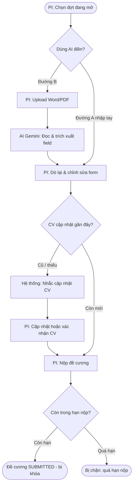
```mermaid
flowchart TD
    A([PI: Chọn đợt đang mở]) --> B{Dùng AI điền?}
    B -- "Đường B" --> C[PI: Upload Word/PDF]
    C --> D[AI Gemini: Đọc & trích xuất field]
    D --> E[PI: Dò lại & chỉnh sửa form]
    B -- "Đường A nhập tay" --> E
    E --> F{CV cập nhật gần đây?}
    F -- "Cũ / thiếu" --> G[Hệ thống: Nhắc cập nhật CV]
    G --> H[PI: Cập nhật hoặc xác nhận CV]
    H --> I[PI: Nộp đề cương]
    F -- "Còn mới" --> I
    I --> J{Còn trong hạn nộp?}
    J -- "Còn hạn" --> K([Đề cương SUBMITTED - bị khóa])
    J -- "Quá hạn" --> L([Bị chặn: quá hạn nộp])
```

### 9.2 Xét duyệt hội đồng (Thư ký soạn → Chủ tịch quyết)
> Phase B: vòng thuộc lĩnh vực-trong-đợt; **1 hội đồng chấm NHÓM đề tài** (assignment); điểm + biên bản tách **theo từng đề tài**; Chủ tịch khóa biên bản từng đề tài.
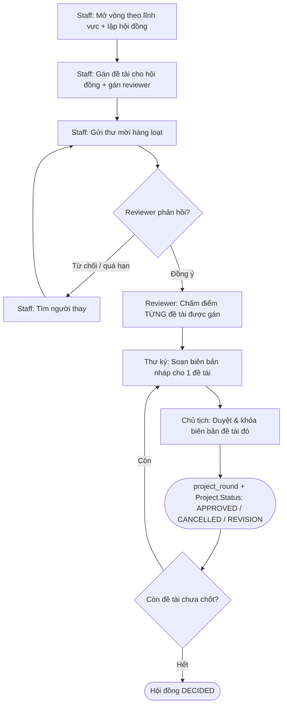
```mermaid
flowchart TD
    A[Staff: Mở vòng theo lĩnh vực + lập hội đồng] --> A2[Staff: Gán đề tài cho hội đồng + gán reviewer]
    A2 --> B[Staff: Gửi thư mời hàng loạt]
    B --> C{Reviewer phản hồi?}
    C -- "Từ chối / quá hạn" --> D[Staff: Tìm người thay]
    D --> B
    C -- "Đồng ý" --> E[Reviewer: Chấm điểm TỪNG đề tài được gán]
    E --> F[Thư ký: Soạn biên bản nháp cho 1 đề tài]
    F --> G[Chủ tịch: Duyệt & khóa biên bản đề tài đó]
    G --> H([project_round + Project.Status: APPROVED / CANCELLED / REVISION])
    H --> I{Còn đề tài chưa chốt?}
    I -- "Còn" --> F
    I -- "Hết" --> J([Hội đồng DECIDED])
```

### 9.3 Đề tài đặt hàng - Applied (cạnh tranh nhiều PI, 1 winner)
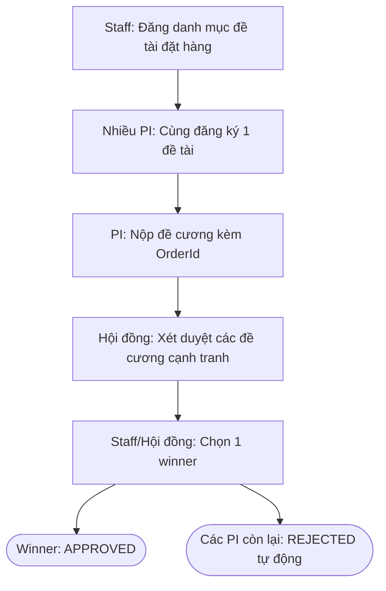
```mermaid
flowchart TD
    A[Staff: Đăng danh mục đề tài đặt hàng] --> B[Nhiều PI: Cùng đăng ký 1 đề tài]
    B --> C[PI: Nộp đề cương kèm OrderId]
    C --> D[Hội đồng: Xét duyệt các đề cương cạnh tranh]
    D --> E[Staff/Hội đồng: Chọn 1 winner]
    E --> F([Winner: APPROVED])
    E --> G([Các PI còn lại: REJECTED tự động])
```

### 9.4 Hợp đồng + giải ngân (giải ngân KHÔNG tự động)
> Sau refactor: hợp đồng neo **project**; **1 đề tài → n hợp đồng** (từng giai đoạn, mỗi HĐ có `contract_phase` + nhóm sản phẩm); ký HĐ → Project IN_PROGRESS.
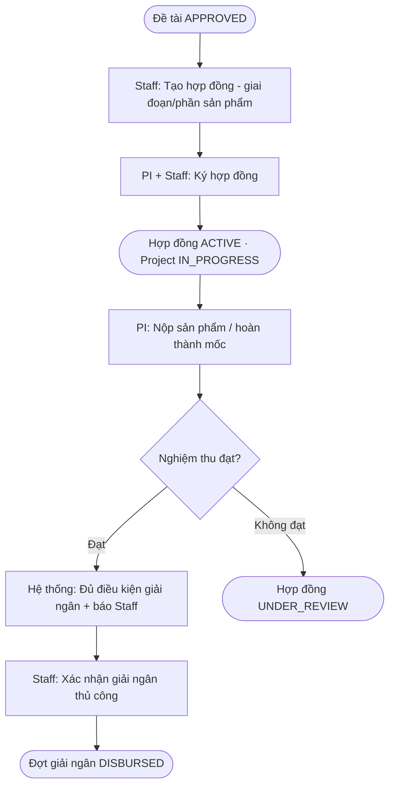
```mermaid
flowchart TD
    A([Đề tài APPROVED]) --> B[Staff: Tạo hợp đồng - giai đoạn/phần sản phẩm]
    B --> C[PI + Staff: Ký hợp đồng]
    C --> D([Hợp đồng ACTIVE · Project IN_PROGRESS])
    D --> E[PI: Nộp sản phẩm / hoàn thành mốc]
    E --> F{Nghiệm thu đạt?}
    F -- "Đạt" --> G[Hệ thống: Đủ điều kiện giải ngân + báo Staff]
    G --> H[Staff: Xác nhận giải ngân thủ công]
    H --> I([Đợt giải ngân DISBURSED])
    F -- "Không đạt" --> J([Hợp đồng UNDER_REVIEW])
```

### 9.5 Báo cáo tiến độ + nghiệm thu
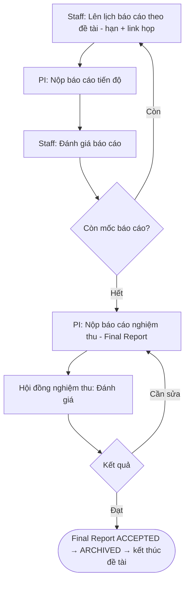
```mermaid
flowchart TD
    A[Staff: Lên lịch báo cáo theo đề tài - hạn + link họp] --> B[PI: Nộp báo cáo tiến độ]
    B --> C[Staff: Đánh giá báo cáo]
    C --> D{Còn mốc báo cáo?}
    D -- "Còn" --> A
    D -- "Hết" --> E[PI: Nộp báo cáo nghiệm thu - Final Report]
    E --> F[Hội đồng nghiệm thu: Đánh giá]
    F --> G{Kết quả}
    G -- "Cần sửa" --> E
    G -- "Đạt" --> H([Final Report ACCEPTED → ARCHIVED → kết thúc đề tài])
```

### 9.6 Yêu cầu thay đổi đề tài (gia hạn / nội dung / nhân sự / kinh phí / tạm dừng)
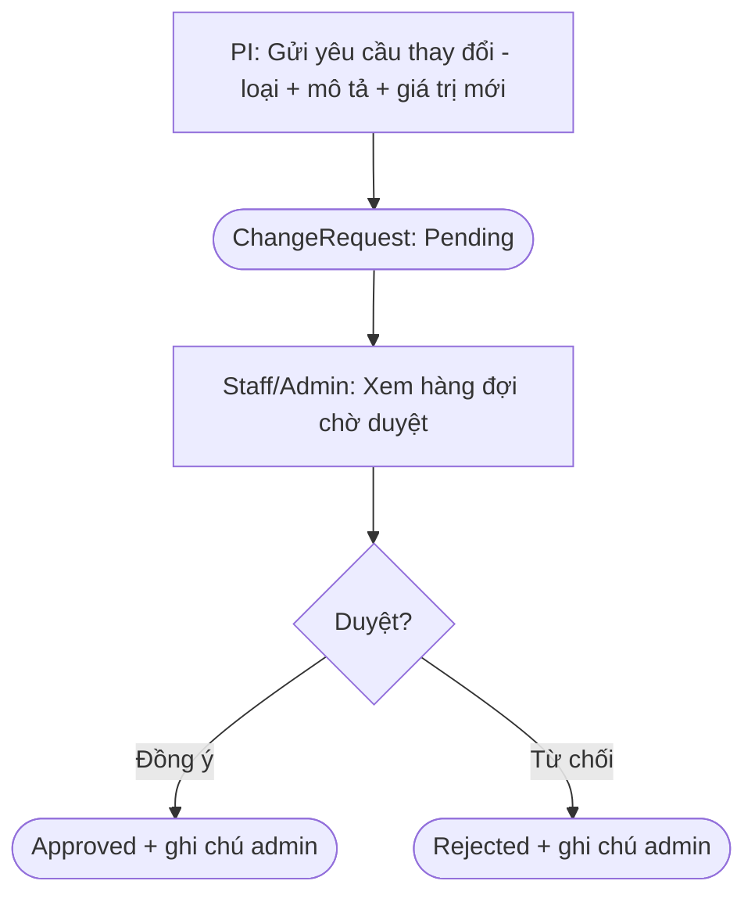
```mermaid
flowchart TD
    A[PI: Gửi yêu cầu thay đổi - loại + mô tả + giá trị mới] --> B([ChangeRequest: Pending])
    B --> C[Staff/Admin: Xem hàng đợi chờ duyệt]
    C --> D{Duyệt?}
    D -- "Đồng ý" --> E([Approved + ghi chú admin])
    D -- "Từ chối" --> F([Rejected + ghi chú admin])
```
